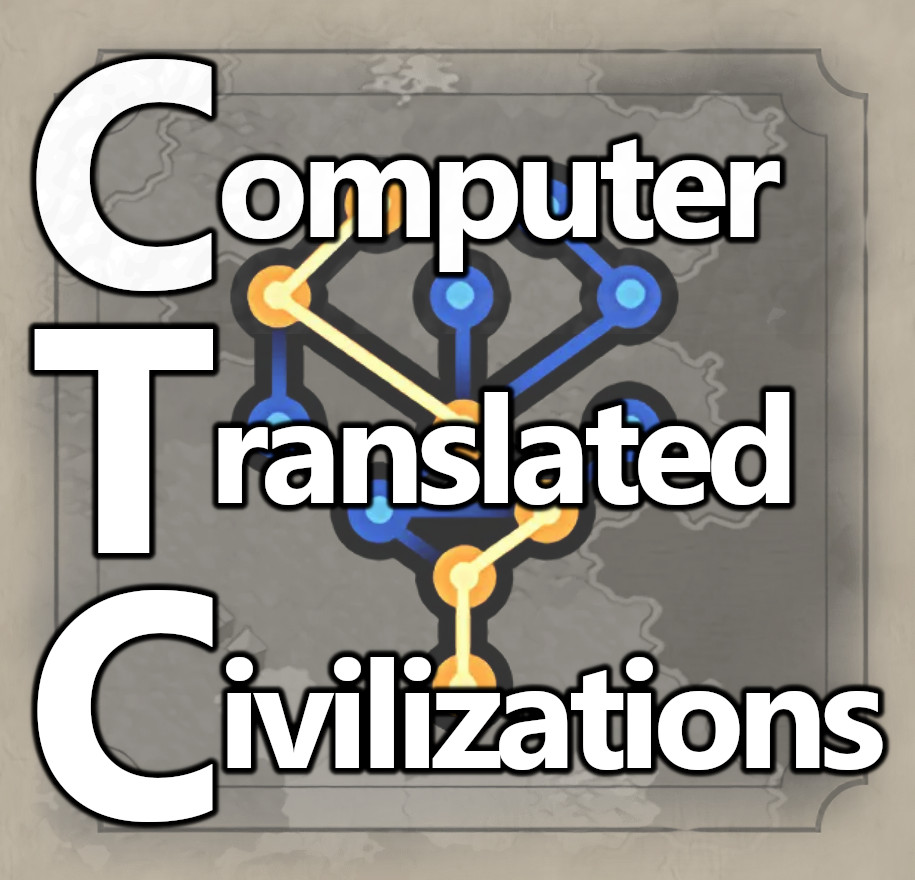

# CTC - Computer Translated Civilizations

Getting confused with all these 谁应该明白 ?  
Don't know what all this 읽을 수 없는 텍스트 is about ?  
Wishing there would be some kind of コンピュータ翻訳 ?  
Or at least something using the западный алфавит ?

**Relief is in sight!**

This mod is a collection of auto-generated translations for Civ VI civilization mods.

Please note: **This is a *BETTER THAN NOTHING* approach!**

These translations are far from being perfect and sometimes even wrong.
This is what google.translate returns as translation.

**There is no proofreading, no corrections are made!**

Again: this is what google.translate returns as translation. Nothing more, nothing less.

## Auto-translated mods
Auto-generated translations for the following mods are currently included in this mod:

| ID  | Name  | English  |
|-----|-------|----------|
| [2135227579](https://steamcommunity.com/sharedfiles/filedetails/?id=2135227579) | Arknights W | - |
| [2640640037](https://steamcommunity.com/sharedfiles/filedetails/?id=2640640037) | 魔法纪录系列：调整屋与puella care | Magic Records Series: Adjustment House and puella care |
| [2650882239](https://steamcommunity.com/sharedfiles/filedetails/?id=2650882239) | 白鸟歌野是勇者 | Shiratori Utano is a brave man |
| [2656801909](https://steamcommunity.com/sharedfiles/filedetails/?id=2656801909) | 魔法纪录系列：神滨魔法联盟（南区） | Magic Records Series: Kamihama Magic League (South Area) |
| [2662246825](https://steamcommunity.com/sharedfiles/filedetails/?id=2662246825) | 魔法纪录系列：誓约之血 | Magic Records Series: Blood of the Covenant |
| [2684671258](https://steamcommunity.com/sharedfiles/filedetails/?id=2684671258) | Ophidy's Allesino 科技之邦艾尔拉西诺 | Ophidy's Allesino |
| [2677539335](https://steamcommunity.com/sharedfiles/filedetails/?id=2677539335) | 【touhou mod】太阳花田-风见幽香 | 【touhou mod】Sun Flower Field-Kazemi Yuka |
| [2691736551](https://steamcommunity.com/sharedfiles/filedetails/?id=2691736551) | 魔法纪录系列：时女一族 | Magical Records Series: Time Ladies |
| [2724414725](https://steamcommunity.com/sharedfiles/filedetails/?id=2724414725) | Ophidy's Luxure 精灵国度拉克修尔 | Ophidy's Luxure |
| [2778172988](https://steamcommunity.com/sharedfiles/filedetails/?id=2778172988) | 楠芽吹是勇者 | Nan Mebuki is a brave man |
| [2837886503](https://steamcommunity.com/sharedfiles/filedetails/?id=2837886503) | 丁真领导的理塘文明 | Litang Civilization led by Ding Zhen |
| [2863254283](https://steamcommunity.com/sharedfiles/filedetails/?id=2863254283) | 崩坏·太虚剑派 | Collapse·Taixu Sword School |
| [2888924215](https://steamcommunity.com/sharedfiles/filedetails/?id=2888924215) | [TOUHOU]东方Project领袖包———依神紫苑 | [TOUHOU] Oriental Project leader Bao ——— Yishen Aster |
| [2899426416](https://steamcommunity.com/sharedfiles/filedetails/?id=2899426416) | Date.A.Live-Core | Date.A.Live-Core |
| [2903392018](https://steamcommunity.com/sharedfiles/filedetails/?id=2903392018) | 明日方舟 幽灵鲨 | Tomorrow's Ark Ghost Shark |
| [2917686453](https://steamcommunity.com/sharedfiles/filedetails/?id=2917686453) | [TOUHOU]东方project MOD——魂魄妖梦 | [TOUHOU] Oriental project mod - Soul Demon Dream |
| [2919794042](https://steamcommunity.com/sharedfiles/filedetails/?id=2919794042) | [TouHou]东方project MOD 河城荷取 | [TouHou] Oriental project MOD River City Hotori |
| [2921739891](https://steamcommunity.com/sharedfiles/filedetails/?id=2921739891) | 东方PROJECT 比那名居天子 | Touhou Project Hinana Juten |
| [2924636331](https://steamcommunity.com/sharedfiles/filedetails/?id=2924636331) | 归离原·归离集·归终 | Return to the original · Return to the collection · Return to the end |
| [2924695333](https://steamcommunity.com/sharedfiles/filedetails/?id=2924695333) | 天有烘炉,地生五金 | There is an oven in the sky, hardware from the earth |
| [2928173382](https://steamcommunity.com/sharedfiles/filedetails/?id=2928173382) | Date.A.Live-Sonogami Rinne, Rio Reloaded | Date.A.Live-Sonogami Rinne, Rio Reloaded |
| [2931262824](https://steamcommunity.com/sharedfiles/filedetails/?id=2931262824) | 诸葛亮领导的中国文明 | Chinese civilization led by Zhuge Liang |
| [2932334915](https://steamcommunity.com/sharedfiles/filedetails/?id=2932334915) | 东方TOUHOU PROJECT  八云紫和八云蓝 | Touhou TOUHOU PROJECT Yakumo Purple and Yakumo Blue |
| [2933896742](https://steamcommunity.com/sharedfiles/filedetails/?id=2933896742) | Date.A.Live-ItsukaKotori Reloaded | Date.A.Live-ItsukaKotori Reloaded |
| [2934144626](https://steamcommunity.com/sharedfiles/filedetails/?id=2934144626) | 永不落幕的支配剧场 | Never Ending Theater of Domination |
| [2935800893](https://steamcommunity.com/sharedfiles/filedetails/?id=2935800893) | 冯杉领导的Gary王国 | Gary Kingdom led by Feng Shan |
| [2937984514](https://steamcommunity.com/sharedfiles/filedetails/?id=2937984514) | Date.A.Live-YamaiSisters Reloaded | Date.A.Live-YamaiSisters Reloaded |
| [2940769424](https://steamcommunity.com/sharedfiles/filedetails/?id=2940769424) | Date.A.Live-IzayoiMiku Reloaded | Date.A.Live-IzayoiMiku Reloaded |
| [2948711698](https://steamcommunity.com/sharedfiles/filedetails/?id=2948711698) | 丁真领导的理塘文明——役赢丁真，鉴定为以！武！服人 | The Litang Civilization led by Ding Zhen——Yong Ying Ding Zhen, appraised for it! Wu! convincing |
| [2949093921](https://steamcommunity.com/sharedfiles/filedetails/?id=2949093921) | 郑俊飚领导的Bell王国 | The Kingdom of Bell led by Zheng Junbiao |
| [2955421341](https://steamcommunity.com/sharedfiles/filedetails/?id=2955421341) | Date.A.Live-Mayuri Reloaded | Date.A.Live-Mayuri Reloaded |
| [2956947156](https://steamcommunity.com/sharedfiles/filedetails/?id=2956947156) | Touhou东方Project 琪露诺 | Touhou Oriental Project |
| [2957344985](https://steamcommunity.com/sharedfiles/filedetails/?id=2957344985) | 逆熵圣女·布洛妮娅·扎伊切克 | Anti-Entropy Saint Bronya Zajcek |
| [2958957078](https://steamcommunity.com/sharedfiles/filedetails/?id=2958957078) | Ophidy's Karotine 荒漠长河卡洛廷 | Ophidy's Karotine |
| [2962085297](https://steamcommunity.com/sharedfiles/filedetails/?id=2962085297) | 张禹领导的Addis帝国 | The Addis Empire led by Zhang Yu |
| [2964796539](https://steamcommunity.com/sharedfiles/filedetails/?id=2964796539) | Northern Union of Blue Line | - |
| [2965547065](https://steamcommunity.com/sharedfiles/filedetails/?id=2965547065) | [TOU HOU]秘密结社-似梦幻想乡的启迪 | [TOU HOU] Secret Association - Enlightenment of Dream-like Fantasy Town |
| [2966535122](https://steamcommunity.com/sharedfiles/filedetails/?id=2966535122) | [GS] 鍜曞挄鐜嬪浗(EN/CN) | Shu Shu Qiao Qiu Qiao |
| [2966634919](https://steamcommunity.com/sharedfiles/filedetails/?id=2966634919) | 타카나시 호시노의 아비도스 고등학교 | Abydos High School in Hoshino, Takanashi |
| [2967044884](https://steamcommunity.com/sharedfiles/filedetails/?id=2967044884) | 白吉康领导的lance帝国 | The Lance Empire led by Bai Jikang |
| [2967771068](https://steamcommunity.com/sharedfiles/filedetails/?id=2967771068) | 罗德岛的华法琳Warfarin_Civilization Arknights-明日方舟 | Warfarin Warfarin_Civilization Arknights in Rhode Island - Ark of Tomorrow |
| [2967861720](https://steamcommunity.com/sharedfiles/filedetails/?id=2967861720) | 나츠메 이로하의 게헨나 학원 | Gehenna Gakuen in Natsume Iroha |
| [2970750119](https://steamcommunity.com/sharedfiles/filedetails/?id=2970750119) | Ophidy's Solisia 远古回响索利西亚 | Ophidy's Solisia echoes in ancient times|
| [2970823129](https://steamcommunity.com/sharedfiles/filedetails/?id=2970823129) | [TOUHOU]东方project 番外之页——EX露米娅 | [TOUHOU] Oriental Project Fanwai Page – EX Lumia |
| [2974754410](https://steamcommunity.com/sharedfiles/filedetails/?id=2974754410) | Re: Life in a Different World from Zero Witch's Tea Party | Re: Life in a Different World from Zero Witch's Tea Party |

## How does it work?
I wrote a python script that parses the modinfo file of a mod to find the text defintions files. These text definition files are read in. For every entry found without a translation for any of the 11 languages that Civ VI officially knows and supports[*] a request for translation is send to google.translate.

Civ VI uses two file formats for modding and localization (translations): XML and SQL.  
Parsing XML is pretty staight forward and - more or less - easy to do.  
SQL files are much less structured and much harder to parse.

**At this moment only text definition files in XML format are supported!**  
So not every Civ VI civilization mod can be translated by this python script (yet).

[*] Officially known and supported languages by Civilization VI: en_US, fr_FR, de_DE, it_IT, es_ES, ja_JP, ru_RU, pl_PL, ko_KR, zh_Hans_CN, zh_Hant_HK
